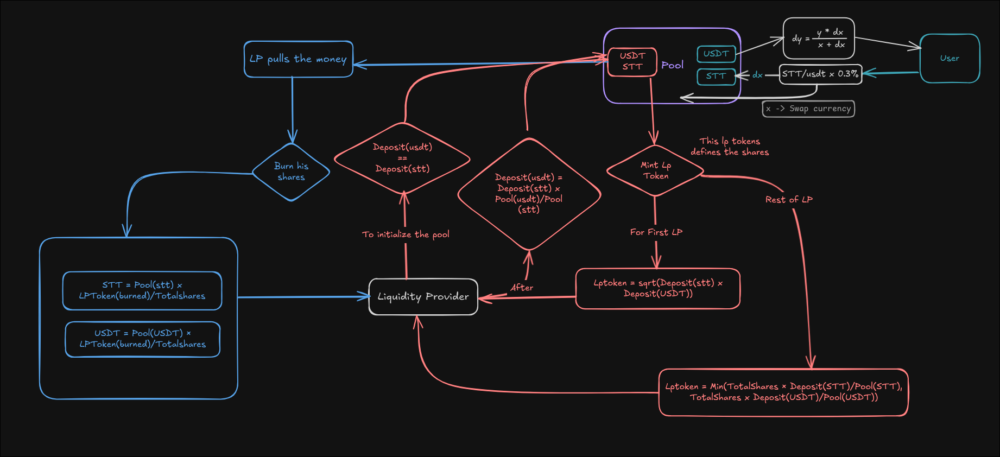
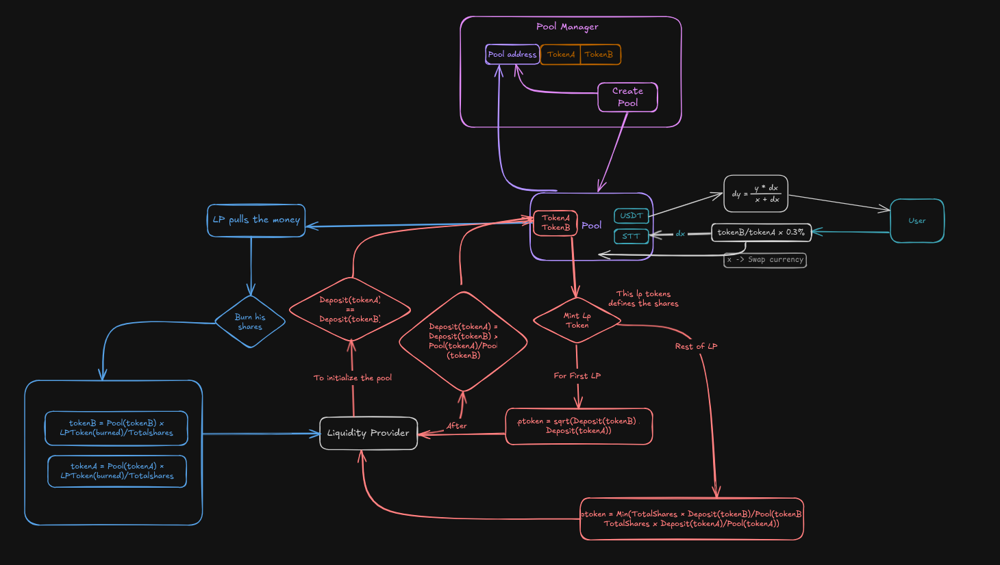

## Liquidity Pool architecture-1



## Liquidity Pool architecture-2



## Deployed Tokens on Sepolia Testnet

- TestStt TST token address
```0x84faF093E7e84f951AEc10567EcA28a627fd3e51```

- TestErc TST token address
```0x39C44Ab0f0678078AD7920F4789A996396f9A70A```

- TSomni Somni token address
```0x6818F6743b187572709706Dd79e495a815ab50Ae```

## Deployed Contracts on Sepolia Testnet

```sh
forge create --rpc-url https://dream-rpc.somnia.network --private-key <PRIVATE_KEY> --broadcast src/PoolManager.sol:PoolManager
```

- PoolManager contract address
```0xfa342983D775a6af6047f0B3daFf15D14984790b```

6.381856540084388186 / 19
